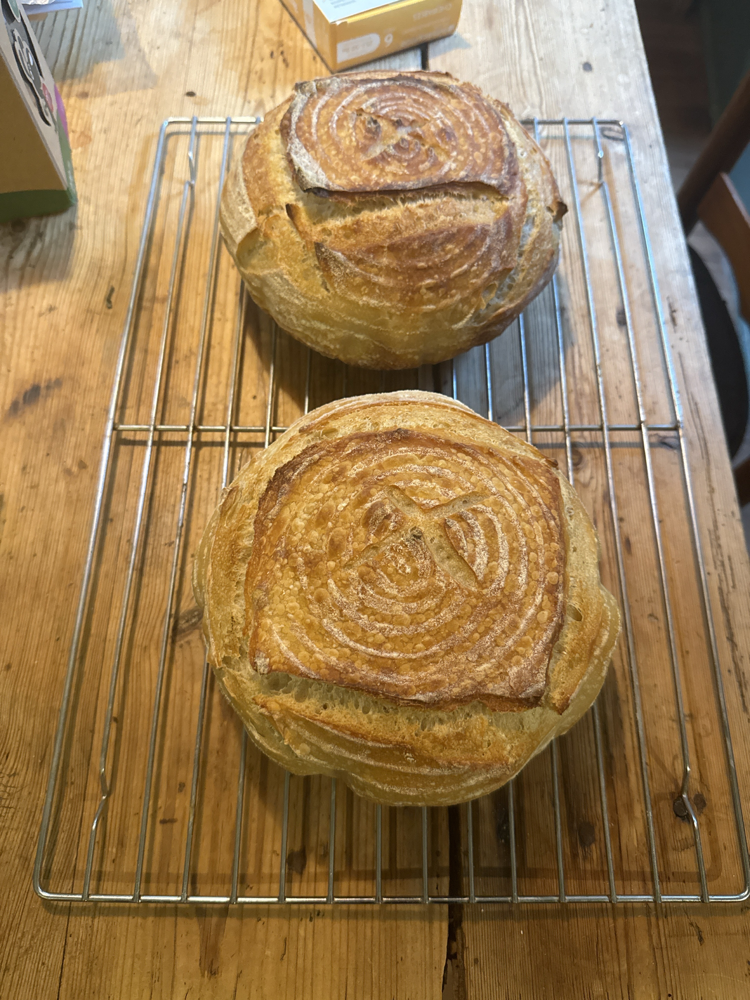
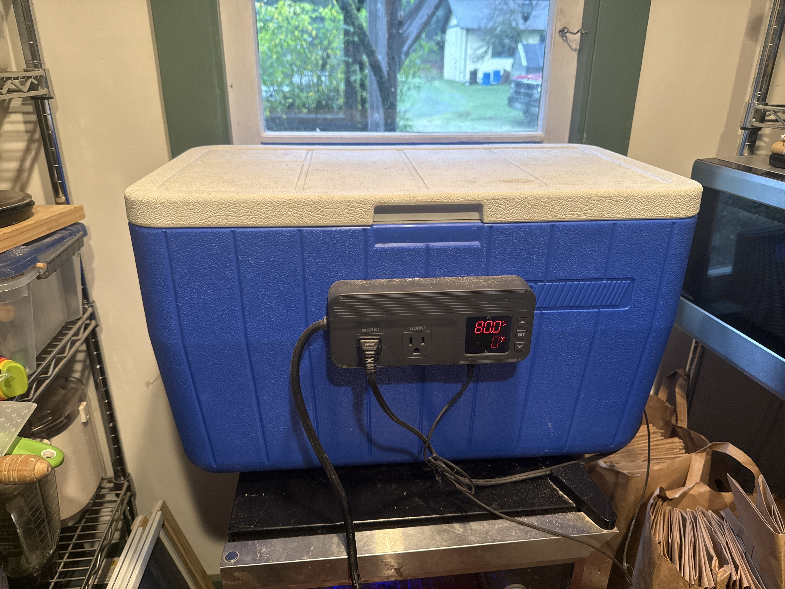
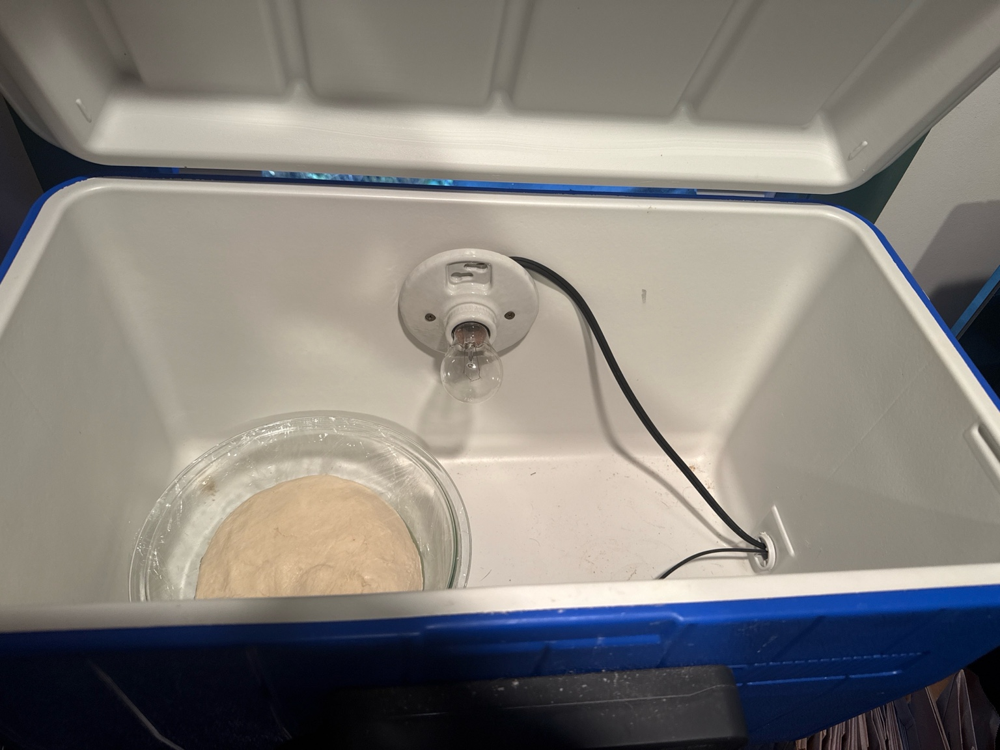
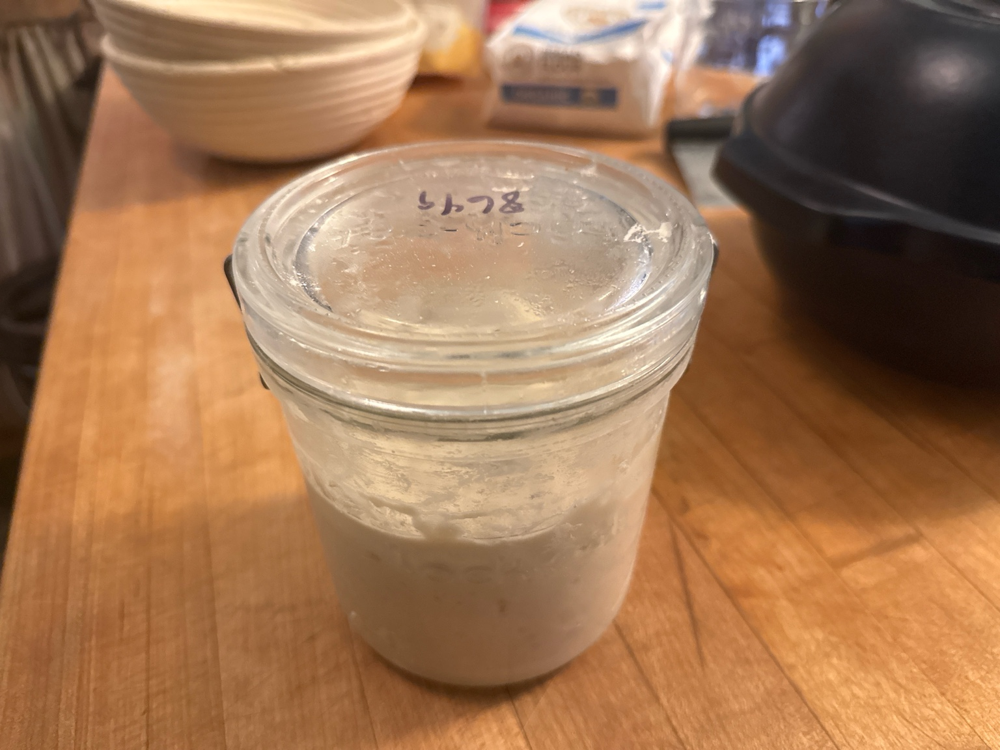

# Richard’s Sourdough Recipe

## Finished Bread

## Ingredients
- 800g King Arthur’s organic unbleached bread flour
- 320g sourdough starter
- 460g water
- 10g salt
- Rice flour (for bannetons)

## Materials
- KitchenAid mixer with bread hook
- Digital scale (grams)
- Mixing bowls
- Clear proofing bowl
- Banneton baskets (2)
- Plastic produce bags
- Razor or bread scoring lame
- Parchment paper
- Dutch oven (preheated)
- Instant-read thermometer (for internal temp 210°F)
- DIY proofing box (cooler, 25W bulb, thermostat controller)

## Detailed Steps
1. Measure 800g flour + 10g salt into KitchenAid bowl (bread hook).
2. Turn mixer to speed 2 to combine flour and salt.
3. Measure 460g water in a separate bowl.
4. Add 320g starter to water and mix.
5. While mixer runs on speed 2, add water/starter; mix 2 minutes.
6. Stop mixer, rest dough 2 minutes.
7. Mix again 4 minutes until smoother.
8. Place dough on floured surface.
9. Perform windowpane test, then fold into a tight ball.
10. Lightly oil a clear bowl with olive oil.
11. Place dough smooth side down, cover with plastic wrap.
12. Place in DIY proofing box 3 hours at 75–80°F.
13. Turn dough onto floured surface after 3 hours.
14. Divide dough into two 800g pieces.
15. Flour two banneton baskets with rice flour.
16. Shape dough into tight balls, smooth side down in bannetons.
17. Lightly flour tops, place baskets in plastic produce bags and seal.
18. Refrigerate overnight (≤24 hours). Refrigerate refreshed starter too.
19. Next morning, remove baskets and rest under tea towel while oven preheats.
20. Preheat Dutch oven in oven.
21. Tip dough onto parchment, place parchment + dough in hot Dutch oven.
22. Score dough with razor or lame.
23. Bake covered at 450°F for 20 minutes.
24. Remove lid, bake uncovered 10 minutes, rotate loaves if needed.
25. Check internal temp every 2.5–5 minutes until 210°F.
26. Cool on rack 2–3 hours.
27. Vacuum seal gently and freeze.

## DIY Proofing Box

- Use a large insulated cooler.
- Install a 25W bulb using a lamp socket.
- Plug lamp into thermostat controller set to 75–80°F.
- Insert thermostat probe through cooler drain hole (no drilling).
- Place dough bowl inside and close lid during bulk fermentation.

## Starter Maintenance

- Always maintain 480g starter total.
- After removing 320g for baking, add:
  - 160g water
  - 160g flour
- Mix thoroughly and refrigerate overnight along with bannetons.

---

## Resources & Links
- [King Arthur Organic Bread Flour](https://shop.kingarthurbaking.com/items/organic-bread-flour)
- [Sourdough starter (Amazon)](https://a.co/d/ik7QW2T)
- [Glass jar (Amazon)](https://a.co/d/0SzIxdR)
- [Thermostat controller (example Inkbird ITC-308)](https://a.co/d/7Qk0z9t)
- [Bread scoring lame (Amazon)](https://a.co/d/28REi4B)